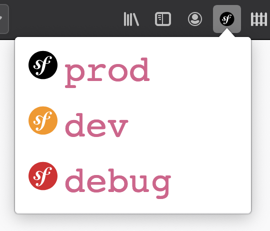

Symfony Environment Switcher
===

This extension is built to switch between your Symfony execution modes:
* `env=prod`
* `env=dev`
* `env=dev` + server side XDebug enabled



Supported domains
---

This extension is restricted to the following local domains:

* `*://*.develop/*`
* `*://*.local/*`
* `*://localhost/*`

What happens
---

The extension adds a `X-Symfony-Env` header to each request sent to your local web server.

This value can be intercepted by your web server or your reverse proxy to redirect the traffic to the proper symfony environment.

Example with an nginx reverse proxy
---

The following example will redirect the traffic to one of 3 web hosts, each one with a specific virtual host declaration (each one using `index.php` or `index_dev.php`, a fpm with Xdebug and another without). 

```
upstream prod-app {
    server http-worker-prod:80;
}

upstream dev-app {
    server http-worker-dev:80;
}

upstream xdebug-app {
    server http-worker-xdebug:80;
}

map $http_x_symfony_env $pool {
     prod "prod-app";
     dev "dev-app";
     xdebug "xdebug-app";
}

server {
     listen 80;
     server_name _;
     location / {
          proxy_pass http://$pool;

          #standard proxy settings
          proxy_set_header X-Real-IP $remote_addr;
          proxy_redirect off;
          proxy_set_header X-Forwarded-For $proxy_add_x_forwarded_for;
          proxy_set_header Host $http_host;
          proxy_redirect off;
          proxy_set_header X-Forwarded-Proto $scheme;
          proxy_set_header X-NginX-Proxy true;
          proxy_connect_timeout 600;
          proxy_send_timeout 600;
          proxy_read_timeout 600;
          send_timeout 600;
     }
}
```

A more complete implementation can be seen in [kiboko/docker-images](https://github.com/kiboko-labs/docker-images/blob/master/compose/oroplatform/ce/3.1/docker-compose.yml#L24-L38)